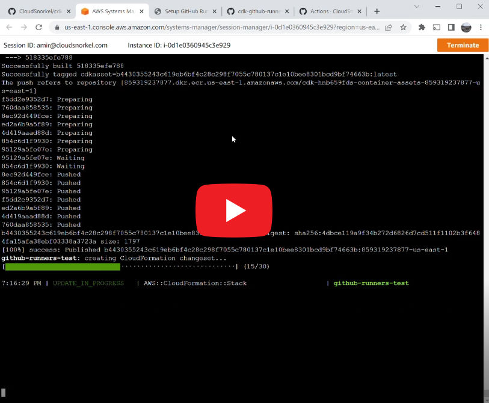
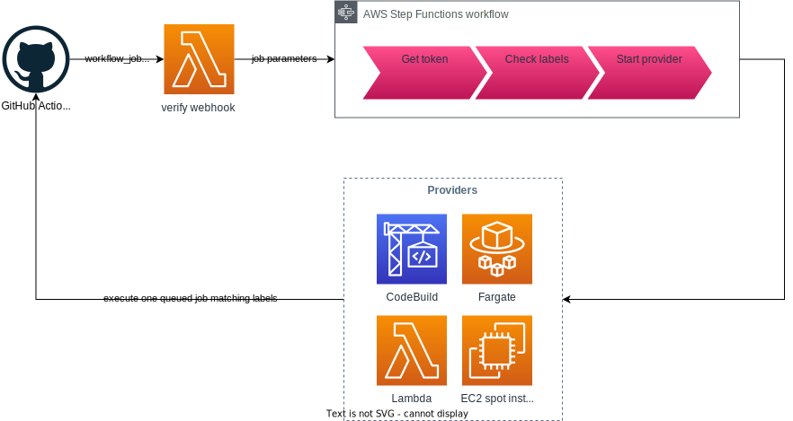

# GitHub Self-Hosted Runners CDK Constructs

[][7]
[][6]
[][8]
[][11]
[][12]
[](https://github.com/CloudSnorkel/cdk-github-runners/actions/workflows/release.yml)
[](https://github.com/CloudSnorkel/cdk-github-runners/blob/main/LICENSE)

Use this CDK construct to create ephemeral [self-hosted GitHub runners][1] on-demand inside your AWS account.

* 🧩 Easy to configure GitHub integration with a web-based interface
* 🧠 Customizable runners with decent defaults
* 🏃🏻 Multiple runner configurations controlled by labels
* 🔐 Everything fully hosted in your account
* 🔃 Automatically updated build environment with latest runner version

Self-hosted runners in AWS are useful when:

* You need easy access to internal resources in your actions
* You want to pre-install some software for your actions
* You want to provide some basic AWS API access (but [aws-actions/configure-aws-credentials][2] has more security controls)
* You are using GitHub Enterprise Server

Ephemeral (or on-demand) runners are the [recommended way by GitHub][14] for auto-scaling, and they make sure all jobs run with a clean image. Runners are started on-demand. You don't pay unless a job is running.

## API

The best way to browse API documentation is on [Constructs Hub][13]. It is available in all supported programming languages.

## Providers

A runner provider creates compute resources on-demand and uses [actions/runner][5] to start a runner.

|                  | EC2               | CodeBuild                  | Fargate        | ECS            | Lambda        |
|------------------|-------------------|----------------------------|----------------|----------------|---------------|
| **Time limit**   | Unlimited         | 8 hours                    | Unlimited      | Unlimited      | 15 minutes    |
| **vCPUs**        | Unlimited         | 2, 4, 8, or 72             | 0.25 to 4      | Unlimited      | 1 to 6        |
| **RAM**          | Unlimited         | 3gb, 7gb, 15gb, or 145gb   | 512mb to 30gb  | Unlimited      | 128mb to 10gb |
| **Storage**      | Unlimited         | 50gb to 824gb              | 20gb to 200gb  | Unlimited      | Up to 10gb    |
| **Architecture** | x86_64, ARM64     | x86_64, ARM64              | x86_64, ARM64  | x86_64, ARM64  | x86_64, ARM64 |
| **sudo**         | ✔                 | ✔                         | ✔              | ✔              | ❌           |
| **Docker**       | ✔                 | ✔ (Linux only)            | ❌              | ✔              | ❌           |
| **Spot pricing** | ✔                 | ❌                         | ✔              | ✔              | ❌           |
| **OS**           | Linux, Windows    | Linux, Windows             | Linux, Windows | Linux, Windows | Linux         |

The best provider to use mostly depends on your current infrastructure. When in doubt, CodeBuild is always a good choice. Execution history and logs are easy to view, and it has no restrictive limits unless you need to run for more than 8 hours.

* EC2 is useful when you want runners to have complete access to the host
* ECS is useful when you want to control the infrastructure, like leaving the runner host running for faster startups
* Lambda is useful for short jobs that can work within time, size and readonly system constraints

You can also create your own provider by implementing `IRunnerProvider`.

## Installation

1. Install and use the appropriate package
   <details><summary>Python</summary>

   ### Install
   Available on [PyPI][6].
   ```bash
   pip install cloudsnorkel.cdk-github-runners
   ```
   ### Use
   ```python
   from aws_cdk import App, Stack
   from cloudsnorkel.cdk_github_runners import GitHubRunners
   
   app = App()
   stack = Stack(app, "github-runners")
   GitHubRunners(stack, "runners")
   
   app.synth()
   ```
   </details>
   <details><summary>TypeScript or JavaScript</summary>

   ### Install
   Available on [npm][7].
   ```bash
   npm i @cloudsnorkel/cdk-github-runners
   ```
   ### Use
   ```typescript
   import { App, Stack } from 'aws-cdk-lib';
   import { GitHubRunners } from '@cloudsnorkel/cdk-github-runners';
   
   const app = new App();
   const stack = new Stack(app, 'github-runners');
   new GitHubRunners(stack, 'runners');
   
   app.synth();
   ```
   </details>
   <details><summary>Java</summary>

   ### Install
   Available on [Maven][8].
   ```xml
   <dependency>
      <groupId>com.cloudsnorkel</groupId>
      <artifactId>cdk.github.runners</artifactId>
   </dependency>
   ```
   ### Use
   ```java
   import software.amazon.awscdk.App;
   import software.amazon.awscdk.Stack;
   import com.cloudsnorkel.cdk.github.runners.GitHubRunners;
   
   public class Example {
     public static void main(String[] args){
       App app = new App();
       Stack stack = new Stack(app, "github-runners");
       GitHubRunners.Builder.create(stack, "runners").build();
   
       app.synth();
     }
   } 
   ```
   </details>
   <details><summary>Go</summary>

   ### Install
   Available on [GitHub][11].
   ```bash
   go get github.com/CloudSnorkel/cdk-github-runners-go/cloudsnorkelcdkgithubrunners
   ```
   ### Use
   ```go
   package main

   import (
     "github.com/CloudSnorkel/cdk-github-runners-go/cloudsnorkelcdkgithubrunners"
     "github.com/aws/aws-cdk-go/awscdk/v2"
     "github.com/aws/jsii-runtime-go"
   )
   
   func main() {
     app := awscdk.NewApp(nil)
     stack := awscdk.NewStack(app, jsii.String("github-runners"), &awscdk.StackProps{})
     cloudsnorkelcdkgithubrunners.NewGitHubRunners(stack, jsii.String("runners"), &cloudsnorkelcdkgithubrunners.GitHubRunnersProps{})
   
     app.Synth(nil)
   }
   ```
   </details>
   <details><summary>.NET</summary>

   ### Install
   Available on [Nuget][12].
   ```bash
   dotnet add package CloudSnorkel.Cdk.Github.Runners
   ```
   ### Use
   ```csharp
   using Amazon.CDK;
   using CloudSnorkel;
   
   namespace Example
   {
     sealed class Program
     {
       public static void Main(string[] args)
       {
         var app = new App();
         var stack = new Stack(app, "github-runners");
         new GitHubRunners(stack, "runners");
         app.Synth();
       }
     }
   }
   ```
   </details>
2. Use `GitHubRunners` construct in your code (starting with default arguments is fine)
3. Deploy your stack
4. Look for the status command output similar to `aws --region us-east-1 lambda invoke --function-name status-XYZ123 status.json`
   ```
    ✅  github-runners-test

   ✨  Deployment time: 260.01s
   
   Outputs:
   github-runners-test.runnersstatuscommand4A30F0F5 = aws --region us-east-1 lambda invoke --function-name github-runners-test-runnersstatus1A5771C0-mvttg8oPQnQS status.json
   ```
5. Execute the status command (you may need to specify `--profile` too) and open the resulting `status.json` file
6. Open the URL in `github.setup.url` from `status.json` or [manually setup GitHub](SETUP_GITHUB.md) integration as an app or with personal access token
7. Run status command again to confirm `github.auth.status` and `github.webhook.status` are OK
8. Trigger a GitHub action that has a `self-hosted` label with `runs-on: [self-hosted, linux, codebuild]` or similar
9. If the action is not successful, see [troubleshooting](#Troubleshooting)

[](https://youtu.be/wlyv_3V8lIw)

## Customizing

The default providers configured by `GitHubRunners` are useful for testing but probably not too much for actual production work. They run in the default VPC or no VPC and have no added IAM permissions. You would usually want to configure the providers yourself.

For example:

```typescript
let vpc: ec2.Vpc;
let runnerSg: ec2.SecurityGroup;
let dbSg: ec2.SecurityGroup;
let bucket: s3.Bucket;

// create a custom CodeBuild provider
const myProvider = new CodeBuildRunnerProvider(this, 'codebuild runner', {
   labels: ['my-codebuild'],
   vpc: vpc,
   securityGroups: [runnerSg],
});
// grant some permissions to the provider
bucket.grantReadWrite(myProvider);
dbSg.connections.allowFrom(runnerSg, ec2.Port.tcp(3306), 'allow runners to connect to MySQL database');

// create the runner infrastructure
new GitHubRunners(this, 'runners', {
   providers: [myProvider],
});
```

Another way to customize runners is by modifying the image used to spin them up. The image contains the [runner][5], any required dependencies, and integration code with the provider. You may choose to customize this image by adding more packages, for example.

```typescript
const myBuilder = FargateRunnerProvider.imageBuilder(this, 'image builder');
myBuilder.addComponent(
  RunnerImageComponent.custom({ commands: ['apt install -y nginx xz-utils'] }),
);

const myProvider = new FargateRunnerProvider(this, 'fargate runner', {
   labels: ['customized-fargate'],
   imageBuilder: myBuilder,
});

// create the runner infrastructure
new GitHubRunners(this, 'runners', {
   providers: [myProvider],
});
```

Your workflow will then look like:

```yaml
name: self-hosted example
on: push
jobs:
  self-hosted:
    runs-on: [self-hosted, customized-fargate]
    steps:
      - run: echo hello world
```

Windows images can also be customized the same way.

```typescript
const myWindowsBuilder = FargateRunnerProvider.imageBuilder(this, 'Windows image builder', {
   architecture: Architecture.X86_64,
   os: Os.WINDOWS,
});
myWindowsBuilder.addComponent(
   RunnerImageComponent.custom({
     name: 'Ninja',
     commands: [
       'Invoke-WebRequest -UseBasicParsing -Uri "https://github.com/ninja-build/ninja/releases/download/v1.11.1/ninja-win.zip" -OutFile ninja.zip',
       'Expand-Archive ninja.zip -DestinationPath C:\\actions',
       'del ninja.zip',
     ],
   }),
);

const myProvider = new FargateRunnerProvider(this, 'fargate runner', {
   labels: ['customized-windows-fargate'],
   imageBuilder: myWindowsBuilder,
});

new GitHubRunners(this, 'runners', {
   providers: [myProvider],
});
```

The runner OS and architecture is determined by the image it is set to use. For example, to create a Fargate runner provider for ARM64 set the `architecture` property for the image builder to `Architecture.ARM64` in the image builder properties.

```typescript
new GitHubRunners(this, 'runners', {
   providers: [
      new FargateRunnerProvider(this, 'fargate runner', {
         labels: ['arm64', 'fargate'],
         imageBuilder: FargateRunnerProvider.imageBuilder(this, 'image builder', {
            architecture: Architecture.ARM64,
            os: Os.LINUX_UBUNTU,
         }),
      }),
   ],
});
```

## Architecture



## Troubleshooting

Runners are started in response to a webhook coming in from GitHub. If there are any issues starting the runner like missing capacity or transient API issues, the provider will keep retrying for 24 hours. Configuration issue related errors like pointing to a missing AMI will not be retried. GitHub itself will cancel the job if it can't find a runner for 24 hours. If your jobs don't start, follow the steps below to examine all parts of this workflow.

1. Always start with the status function, make sure no errors are reported, and confirm all status codes are OK
2. Make sure `runs-on` in the workflow matches the expected labels set in the runner provider
3. Diagnose relevant executions of the orchestrator step function by visiting the URL in `troubleshooting.stepFunctionUrl` from `status.json`
   1. If the execution failed, check your runner provider configuration for errors
   2. If the execution is still running for a long time, check the execution events to see why runner starting is being retried
   3. If there are no relevant executions, move to the next step
4. Confirm the webhook Lambda was called by visiting the URL in `troubleshooting.webhookHandlerUrl` from `status.json`
   1. If it's not called or logs errors, confirm the webhook settings on the GitHub side
   2. If you see too many errors, make sure you're only sending `workflow_job` events
5. When using GitHub app, make sure there are active installations in `github.auth.app.installations`

All logs are saved in CloudWatch.
* Log group names can be found in `status.json` for each provider, image builder, and other parts of the system
* Some useful Logs Insights queries can be enabled with `GitHubRunners.createLogsInsightsQueries()`

To get `status.json`, check out the CloudFormation stack output for a command that generates it. The command looks like:

```
aws --region us-east-1 lambda invoke --function-name status-XYZ123 status.json
```

## Monitoring

There are two important ways to monitor your runners:

1. Make sure runners don't fail to start. When that happens, jobs may sit and wait. Use `GitHubRunners.metricFailed()` to get a metric for the number of failed runner starts. You should use this metric to trigger an alarm.
2. Make sure runner images don't fail to build. Failed runner image builds mean you will get stuck with out-of-date software on your runners. It may lead to security vulnerabilities, or it may lead to slower runner start-ups as the runner software itself needs to be updated. Use `GitHubRunners.failedImageBuildsTopic()` to get SNS topic that gets notified of failed runner image builds. You should subscribe to this topic.

Other useful metrics to track:

1. Use `GitHubRunners.metricJobCompleted()` to get a metric for the number of completed jobs broken down by labels and job success.
2. Use `GitHubRunners.metricTime()` to get a metric for the total time a runner is running. This includes the overhead of starting the runner.

## Contributing

If you use and love this project, please consider contributing.

1. 🪳 If you see something, say something. [Issues][16] help improve the quality of the project.
   * Include relevant logs and package versions for bugs.
   * When possible, describe the use-case behind feature requests.
1. 🛠️ [Pull requests][17] are welcome.
   * Run `npm run build` before submitting to make sure all tests pass.
   * Allow edits from maintainers so small adjustments can be made easily.
1. 💵 Consider [sponsoring][15] the project to show your support and optionally get your name listed below.

## Other Options

1. [philips-labs/terraform-aws-github-runner][3] if you're using Terraform
2. [actions/actions-runner-controller][4] if you're using Kubernetes


[1]: https://docs.github.com/en/actions/hosting-your-own-runners/about-self-hosted-runners
[2]: https://github.com/marketplace/actions/configure-aws-credentials-action-for-github-actions
[3]: https://github.com/philips-labs/terraform-aws-github-runner
[4]: https://github.com/actions/actions-runner-controller
[5]: https://github.com/actions/runner
[6]: https://pypi.org/project/cloudsnorkel.cdk-github-runners
[7]: https://www.npmjs.com/package/@cloudsnorkel/cdk-github-runners
[8]: https://central.sonatype.com/artifact/com.cloudsnorkel/cdk.github.runners/
[9]: https://docs.github.com/en/developers/apps/getting-started-with-apps/about-apps
[10]: https://docs.github.com/en/authentication/keeping-your-account-and-data-secure/creating-a-personal-access-token
[11]: https://pkg.go.dev/github.com/CloudSnorkel/cdk-github-runners-go/cloudsnorkelcdkgithubrunners
[12]: https://www.nuget.org/packages/CloudSnorkel.Cdk.Github.Runners/
[13]: https://constructs.dev/packages/@cloudsnorkel/cdk-github-runners/
[14]: https://docs.github.com/en/actions/hosting-your-own-runners/autoscaling-with-self-hosted-runners#using-ephemeral-runners-for-autoscaling
[15]: https://github.com/sponsors/CloudSnorkel
[16]: https://github.com/CloudSnorkel/cdk-github-runners/issues
[17]: https://github.com/CloudSnorkel/cdk-github-runners/pulls
